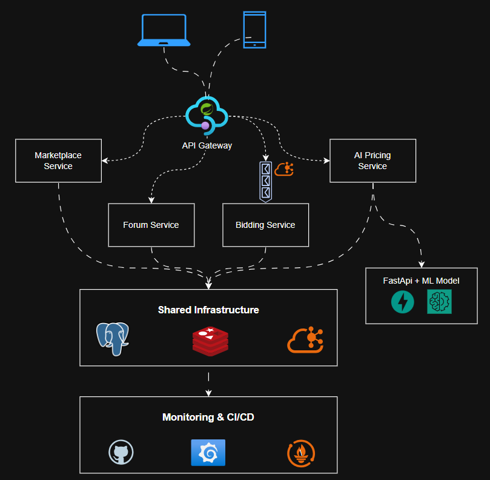

# 🖥️ RigBazaar

RigBazaar is a **modular system** designed for PC & Gaming hardware trading.  
It combines a marketplace, bidding platform, tech forum, and AI-powered price prediction —  
built with **enterprise-grade backend architecture** and modern frontend apps.

---

## 🚀 Features
- **Marketplace** – Post, browse, and search hardware listings.
- **Bidding System** – Bulk hardware auctions with RabbitMQ events.
- **Tech Forum** – Q&A with upvotes, tags, and moderation.
- **AI Price Prediction** – Estimate resale value using ML models.
- **Role-Based Access** – Buyers, sellers, admins, and IT managers.
- **Monitoring & CI/CD** – Prometheus, Grafana, GitHub Actions.

---

## 🏗️ Architecture Overview

RigBazaar follows a **modular, event-driven architecture** with caching and monitoring.

### System Design Diagram
  
*(Diagram created in Draw.io and exported for documentation use)*

---

## 🛠️ Tech Stack

**Frontend**
- React (Web Application)
- Flutter (Mobile App)

**Backend & Infrastructure**
- Spring Boot (Core backend services)
- PostgreSQL (Relational database)
- Redis (Caching layer)
- RabbitMQ (Message broker for events)
- FastAPI + ML Model (Price prediction microservice)

**DevOps & Monitoring**
- Docker & Docker Compose
- GitHub Actions (CI/CD)
- Prometheus & Grafana (Monitoring & observability)

---

## 📌 Project Roadmap

### Phase 1 – MVP
- Marketplace + Forum (monolith with PostgreSQL)
- Authentication & Authorization (Spring Security + JWT)

### Phase 2 – Advanced
- Event-driven bidding with RabbitMQ
- Redis caching for hot listings & forum threads
- CI/CD pipeline with GitHub Actions

### Phase 3 – Enterprise
- AI microservice for price predictions
- Split into microservices with API Gateway
- Monitoring dashboards (Prometheus + Grafana)
- Cloud deployment

---

## 🤝 Contributing
Contributions are welcome! Please open issues or submit PRs with improvements.

---

## 📄 License
This project is licensed under the MIT License.
